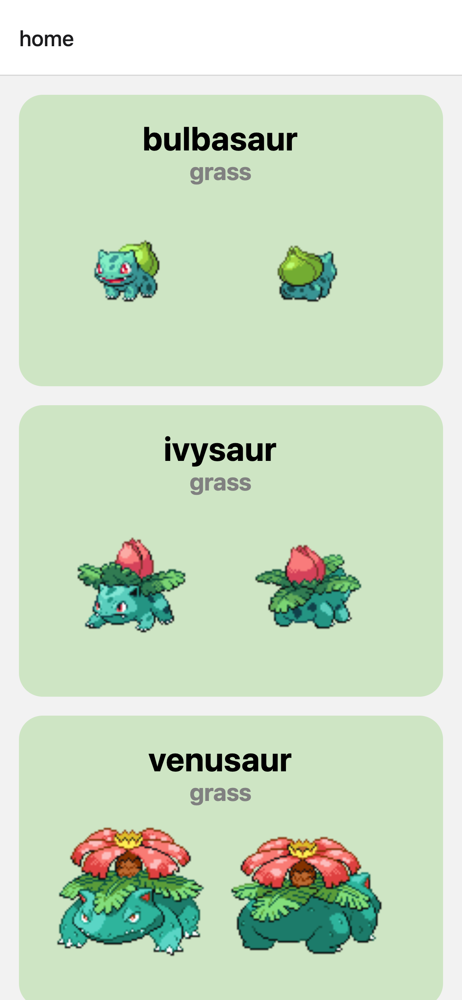

# ⚡ React Native/Expo 학습을 위해 구현한 튜토리얼 실습

React Native와 Expo를 학습하기 위해 만든 포켓몬 목록 앱입니다. [PokeAPI](https://pokeapi.co/)에서 포켓몬 데이터를 가져와 화면에 표시하고, Expo Router를 이용해 상세 화면으로 이동하는 과정을 실습합니다.

## 앱 화면



## 현재 구현된 기능

- PokeAPI에서 포켓몬 20개 조회
- 포켓몬 이름과 타입 표시
- 포켓몬 타입별 카드 색상 적용
- 포켓몬 앞모습과 뒷모습 이미지 표시
- 포켓몬 항목 선택 시 상세 화면으로 이동
- 상세 화면에서 전달받은 포켓몬 이름 표시

## 학습 내용

- React Native 기본 컴포넌트와 스타일 작성
- `useState`와 `useEffect`를 이용한 상태 및 생명주기 관리
- `fetch`와 `Promise.all`을 이용한 API 데이터 조회
- Expo Router의 파일 기반 라우팅
- 화면 간 파라미터 전달과 `useLocalSearchParams` 사용

## TODO

- 상세 화면에서 포켓몬 세부 정보 조회 및 표시

## 기술 스택

- Expo SDK 54
- React Native 0.81
- React 19
- TypeScript
- Expo Router

## 실행 방법

Node.js 20.19 이상이 필요합니다.

```bash
npm install
npm start
```

실행 후 터미널에 표시되는 안내에 따라 Expo Go, Android 에뮬레이터 또는 iOS 시뮬레이터에서 앱을 열 수 있습니다.

플랫폼별로 직접 실행하려면 다음 명령을 사용합니다.

```bash
npm run android
npm run ios
npm run web
```

## 주요 파일

```text
app/
├── _layout.tsx   # 화면 스택과 상세 화면 설정
├── index.tsx     # 포켓몬 목록 화면
└── details.tsx   # 포켓몬 상세 화면
```

## 참고 자료

- [Expo SDK 54 문서](https://docs.expo.dev/versions/v54.0.0/)
- [Expo Router 문서](https://docs.expo.dev/router/introduction/)
- [PokeAPI](https://pokeapi.co/)
- [React Native/Expo 튜토리얼 영상](https://www.youtube.com/watch?v=BUXnASp_WyQ)
